# From Idea to Production: The AI-Powered Development Workflow

> A story of how a user story travels through research, design, and engineering — and where AI skills take the wheel.

---

## The Big Picture

Every feature begins as an idea and ends as code in production. Here's the full journey:

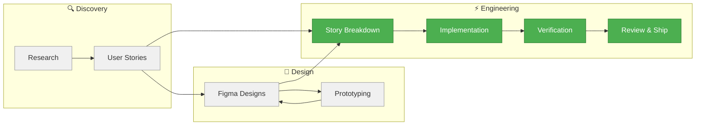

> **Grey** = Outside developer scope (Product, Design, Research teams)
> **Green** = AI-assisted developer workflow (Claude Code Skills)

---

## Act 1: Before We Touch Code

These phases happen before a developer gets involved. They represent opportunities for future automation.

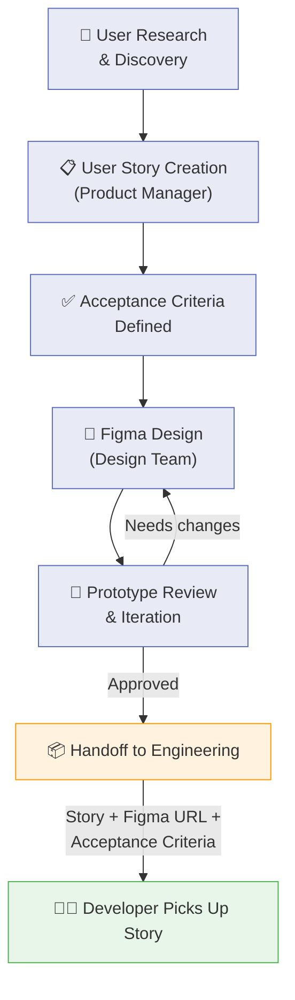

**What the developer receives:**
| Input | Source |
|-------|--------|
| User story with acceptance criteria | Product Manager / Linear |
| Figma design URL | Design Team |
| Any additional context or constraints | Stakeholder discussions |

---

## Act 2: The Developer Workflow (5 Skills, 1 Pipeline)

This is where AI skills orchestrate the entire development process. Each skill hands off to the next like a relay race.

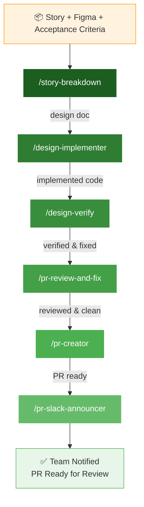

---

## Skill 1: `/story-breakdown`

> *"Turn a vague story into a precise blueprint."*

Takes the user story + Figma URL and produces a detailed technical design document with component specs, token mappings, and implementation slices.

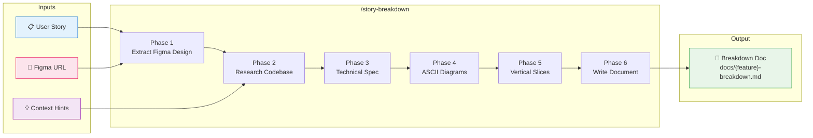

**What happens inside:**

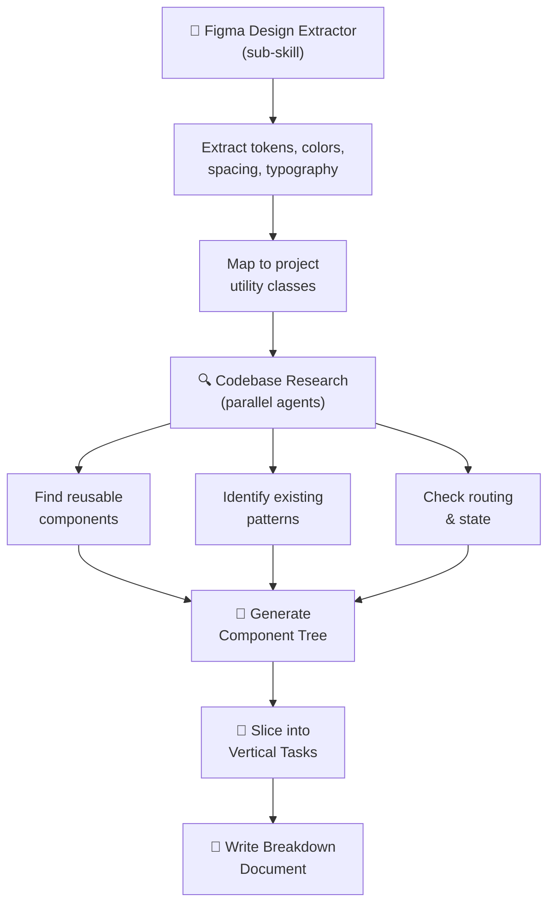

---

## Skill 2: `/design-implementer`

> *"One architect, many builders — working in parallel."*

Reads the breakdown doc and orchestrates a team of AI agents, each working in isolated git worktrees to implement different slices simultaneously.

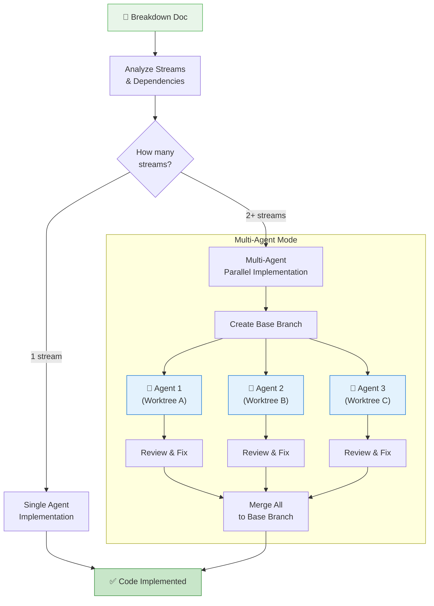

**The pipelining trick — agents don't wait idle:**

```mermaid
gantt
    title Parallel Implementation Timeline
    dateFormat X
    axisFormat %s

    section Agent 1
    Implement Stream A    :a1, 0, 3
    Self-review & fix     :a2, after a1, 1

    section Agent 2
    Implement Stream B    :b1, 0, 4
    Self-review & fix     :b2, after b1, 1

    section Agent 3
    Implement Stream C    :c1, 1, 4
    Self-review & fix     :c2, after c1, 1

    section Lead
    Orchestrate & monitor :l1, 0, 6
    Merge & verify        :l2, after l1, 1
```

---

## Skill 3: `/design-verify`

> *"Does the code match the design? Let's check pixel by pixel."*

Compares the implemented code against the original Figma design and breakdown document, using both static analysis and live browser inspection.

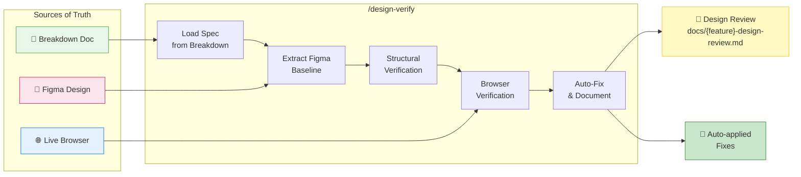

**What gets checked:**

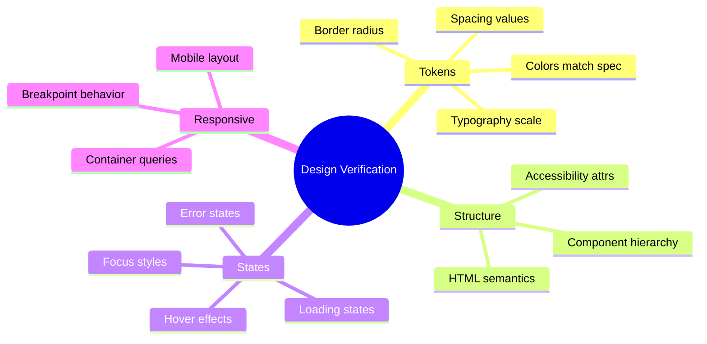

---

## Skill 4: `/pr-review-and-fix`

> *"Review the code. Find the issues. Fix them. All in one pass."*

Runs an AI code review across the changes, identifies problems, and automatically fixes them — no back-and-forth needed.

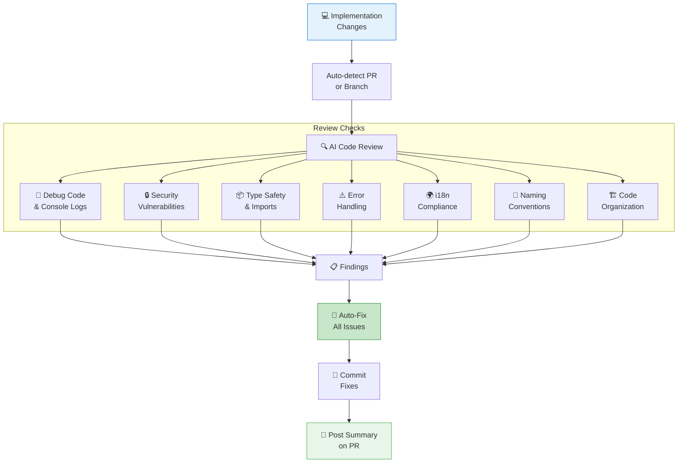

---

## Skill 5: `/pr-creator`

> *"Package it up and ship it out."*

Creates (or updates) the GitHub PR with a clean description, then waits for CI to pass.

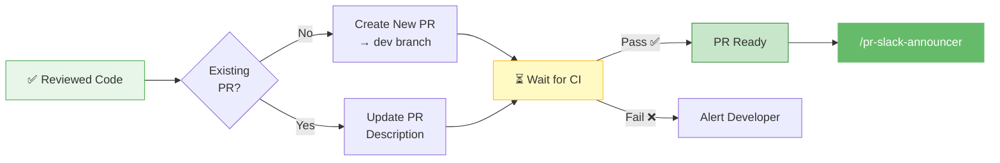

---

## Skill 6: `/pr-slack-announcer`

> *"Hey team, this is ready for your eyes."*

Generates a Slack message with the PR link, preview URL, deep links to changed routes/stories, and testing notes.

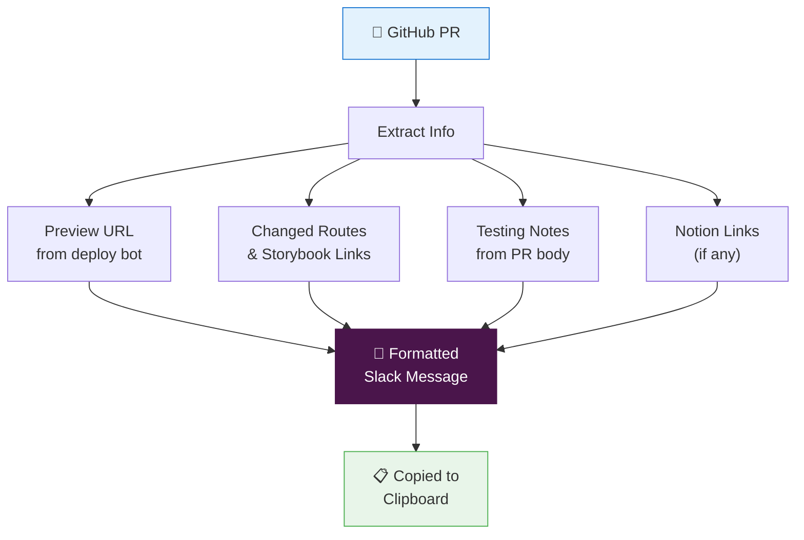

---

## The Complete Data Flow

How artifacts flow between skills from start to finish:

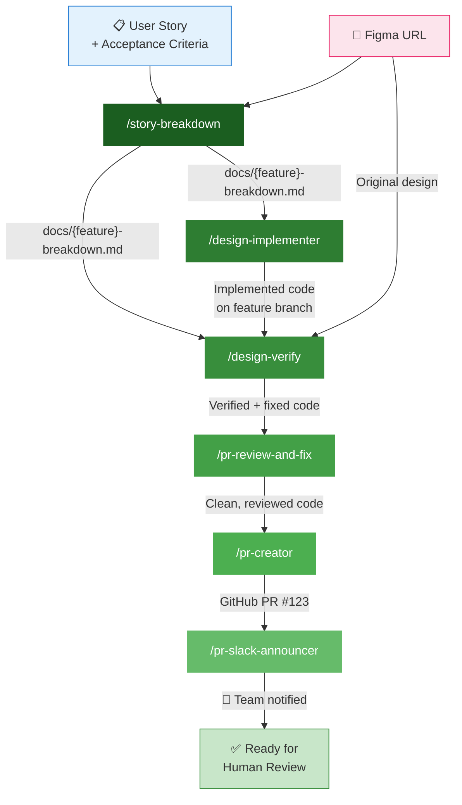

---

## Supporting Cast

These skills aren't in the main pipeline but support it at various points:

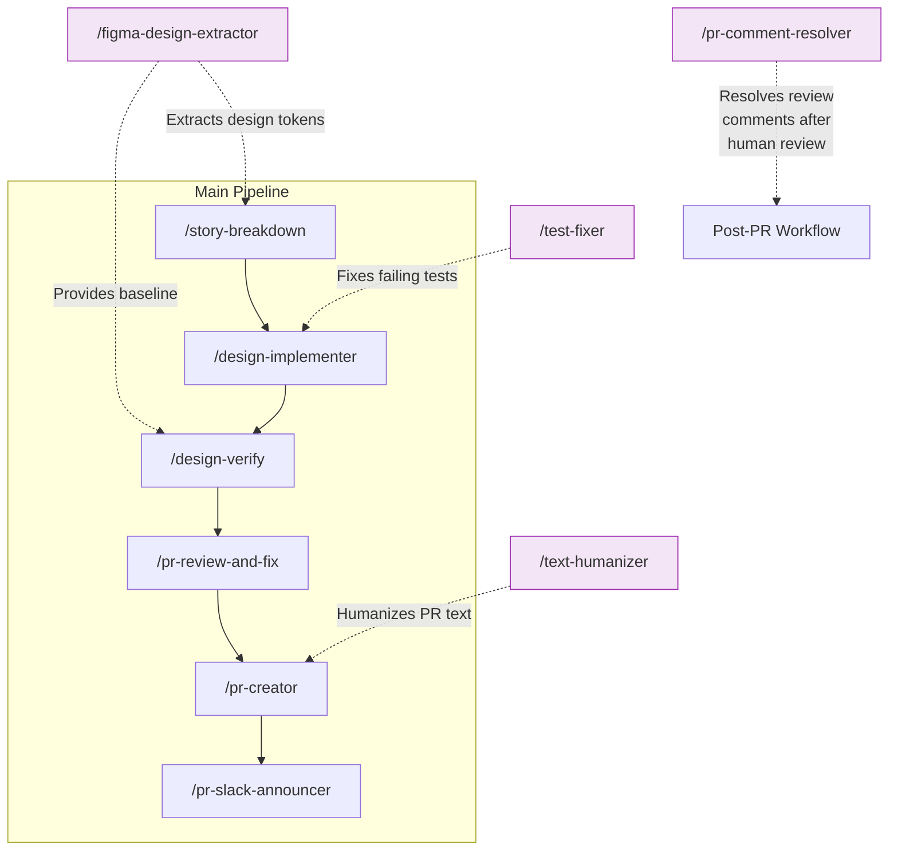

---

## After the PR: The Review Loop

Once the team reviews the PR, there's one more skill that closes the loop:

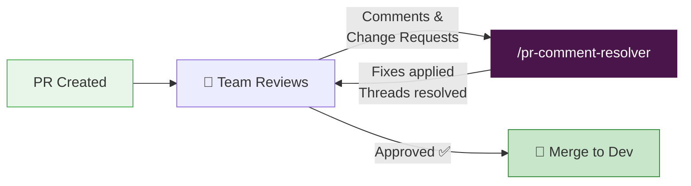

---

## Human vs AI Responsibilities

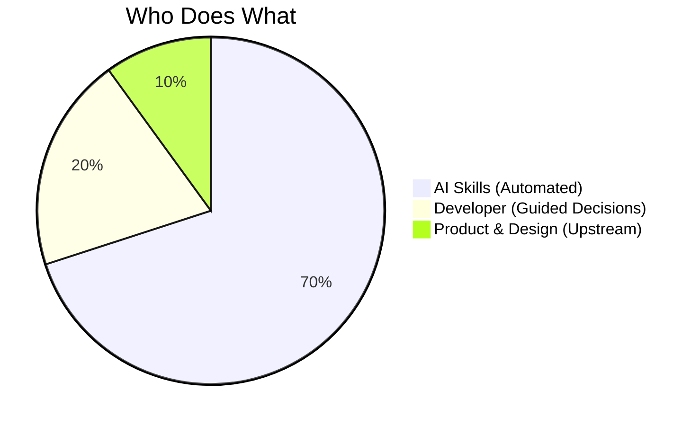

| Phase | Who | What |
|-------|-----|------|
| Research & User Stories | Product | Interviews, prioritization, story writing |
| Figma Design | Design | Visual design, prototyping, iteration |
| **Story Breakdown** | **AI + Developer** | AI analyzes, developer reviews & approves |
| **Implementation** | **AI Agents** | Parallel implementation in worktrees |
| **Design Verification** | **AI** | Automated pixel-level comparison |
| **Code Review & Fix** | **AI** | Automated review against learned patterns |
| **PR Creation** | **AI** | Auto-generated PR with CI monitoring |
| **Slack Announcement** | **AI** | Formatted message with deep links |
| Human Code Review | Team | Final sign-off on quality and approach |
| **Comment Resolution** | **AI + Developer** | AI fixes, developer approves approach |
| Merge & Deploy | Developer | Final merge button press |

---

## The Automation Frontier

Areas outside the current developer workflow where AI could help next:

```mermaid
flowchart TD
    subgraph "🟢 Automated Today"
        A1["Story Breakdown"]
        A2["Code Implementation"]
        A3["Design Verification"]
        A4["Code Review"]
        A5["PR Creation"]
        A6["Team Notification"]
        A7["Comment Resolution"]
    end

    subgraph "🟡 Partially Automated"
        B1["Prototyping<br/>(/yond-prototyper)"]
        B2["Bug Investigation<br/>(/issue-executor)"]
        B3["Test Writing<br/>(/test-fixer)"]
    end

    subgraph "🔴 Manual Today — Future Opportunities"
        C1["User Research<br/>Synthesis"]
        C2["Acceptance Criteria<br/>Generation"]
        C3["Figma Design<br/>from Requirements"]
        C4["Design QA by<br/>Design Team"]
        C5["Release Notes<br/>& Changelog"]
        C6["Stakeholder<br/>Demo Prep"]
    end

    C1 -.->|"Could AI summarize<br/>research findings?"| B1
    C2 -.->|"Could AI draft<br/>criteria from research?"| A1
    C3 -.->|"Could AI generate<br/>initial layouts?"| B1
    C5 -.->|"Could AI compile<br/>from merged PRs?"| A5

    style A1 fill:#C8E6C9,stroke:#388E3C
    style A2 fill:#C8E6C9,stroke:#388E3C
    style A3 fill:#C8E6C9,stroke:#388E3C
    style A4 fill:#C8E6C9,stroke:#388E3C
    style A5 fill:#C8E6C9,stroke:#388E3C
    style A6 fill:#C8E6C9,stroke:#388E3C
    style A7 fill:#C8E6C9,stroke:#388E3C
    style B1 fill:#FFF9C4,stroke:#FBC02D
    style B2 fill:#FFF9C4,stroke:#FBC02D
    style B3 fill:#FFF9C4,stroke:#FBC02D
    style C1 fill:#FFCDD2,stroke:#E53935
    style C2 fill:#FFCDD2,stroke:#E53935
    style C3 fill:#FFCDD2,stroke:#E53935
    style C4 fill:#FFCDD2,stroke:#E53935
    style C5 fill:#FFCDD2,stroke:#E53935
    style C6 fill:#FFCDD2,stroke:#E53935
```

---

## Quick Reference: Skill Cheat Sheet

| Skill | Command | Input | Output |
|-------|---------|-------|--------|
| Story Breakdown | `/story-breakdown` | Story + Figma URL | `docs/{feature}-breakdown.md` |
| Design Implementer | `/design-implementer` | Breakdown doc path | Implemented code on branch |
| Design Verify | `/design-verify` | Breakdown doc path | `docs/{feature}-design-review.md` |
| PR Review & Fix | `/pr-review-and-fix` | PR number (auto-detect) | Fixed code + PR comment |
| PR Creator | `/pr-creator` | Current branch | GitHub PR |
| Slack Announcer | `/pr-slack-announcer` | PR number (auto-detect) | Slack message on clipboard |
| Comment Resolver | `/pr-comment-resolver` | PR with comments | Resolved threads + fixes |
