# From Idea to Production: The AI-Powered Development Workflow

> A story of how a user story travels through research, design, and engineering — and where AI skills take the wheel.

---

## The Big Picture

Every feature begins as an idea and ends as code in production. Here's the full journey:

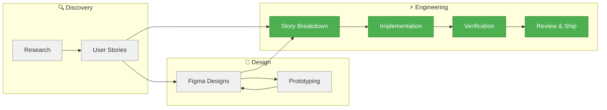
```mermaid
graph LR
    subgraph "🔍 Discovery"
        A[Research] --> B[User Stories]
    end

    subgraph "🎨 Design"
        B --> C[Figma Designs]
        C --> D[Prototyping]
        D --> C
    end

    subgraph "⚡ Engineering"
        B --> E[Story Breakdown]
        C --> E
        E --> F[Implementation]
        F --> G[Verification]
        G --> H[Review & Ship]
    end

    style A fill:#f0f0f0,stroke:#999
    style B fill:#f0f0f0,stroke:#999
    style C fill:#f0f0f0,stroke:#999
    style D fill:#f0f0f0,stroke:#999
    style E fill:#4CAF50,stroke:#2E7D32,color:#fff
    style F fill:#4CAF50,stroke:#2E7D32,color:#fff
    style G fill:#4CAF50,stroke:#2E7D32,color:#fff
    style H fill:#4CAF50,stroke:#2E7D32,color:#fff
```

> **Grey** = Outside developer scope (Product, Design, Research teams)
> **Green** = AI-assisted developer workflow (Claude Code Skills)

---

## Act 1: Before We Touch Code

These phases happen before a developer gets involved. They represent opportunities for future automation.

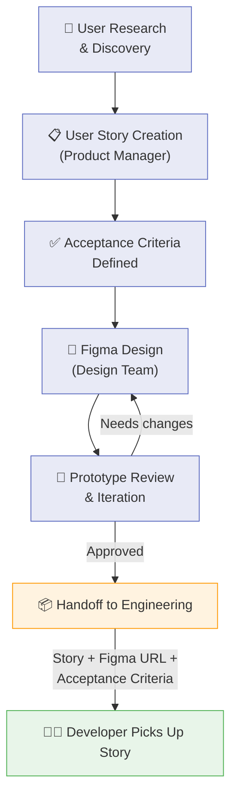
```mermaid
flowchart TD
    R["👥 User Research<br/>& Discovery"] --> US["📋 User Story Creation<br/>(Product Manager)"]
    US --> AC["✅ Acceptance Criteria<br/>Defined"]
    AC --> FD["🎨 Figma Design<br/>(Design Team)"]
    FD --> PR["🧪 Prototype Review<br/>& Iteration"]
    PR -->|Needs changes| FD
    PR -->|Approved| HO["📦 Handoff to Engineering"]

    HO -->|"Story + Figma URL +<br/>Acceptance Criteria"| DEV["👨‍💻 Developer Picks Up Story"]

    style R fill:#E8EAF6,stroke:#5C6BC0
    style US fill:#E8EAF6,stroke:#5C6BC0
    style AC fill:#E8EAF6,stroke:#5C6BC0
    style FD fill:#E8EAF6,stroke:#5C6BC0
    style PR fill:#E8EAF6,stroke:#5C6BC0
    style HO fill:#FFF3E0,stroke:#FF9800
    style DEV fill:#E8F5E9,stroke:#4CAF50
```

**What the developer receives:**
| Input | Source |
|-------|--------|
| User story with acceptance criteria | Product Manager / Linear |
| Figma design URL | Design Team |
| Any additional context or constraints | Stakeholder discussions |

---

## Act 2: The Developer Workflow (5 Skills, 1 Pipeline)

This is where AI skills orchestrate the entire development process. Each skill hands off to the next like a relay race.

> **Where these skills live.** Most of this pipeline has moved to the Yond marketplace —
> `/story-breakdown`, `/pr-creator`, `/pr-reviewer`, `/pr-slack-announcer` and
> `/pr-comment-resolver` ship from `yond-dev`, and `/design-implementer`, `/design-verify` and
> `/figma-design-extractor` from `yond-design`. Only `/test-fixer` (`frontend-tools`) and
> `/text-humanizer` (`general-tools`) still ship from this repo.

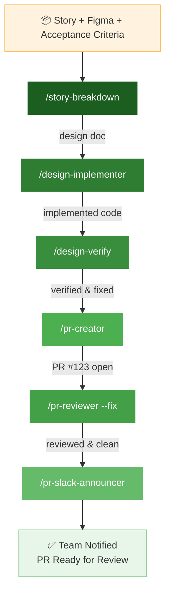
```mermaid
flowchart TD
    INPUT["📦 Story + Figma + Acceptance Criteria"]

    INPUT --> SB["/story-breakdown"]
    SB -->|"design doc"| DI["/design-implementer"]
    DI -->|"implemented code"| DV["/design-verify"]
    DV -->|"verified & fixed"| PRC["/pr-creator"]
    PRC -->|"PR #123 open"| PRR["/pr-reviewer --fix"]
    PRR -->|"reviewed & clean"| PSA["/pr-slack-announcer"]
    PSA --> DONE["✅ Team Notified<br/>PR Ready for Review"]

    style INPUT fill:#FFF3E0,stroke:#FF9800
    style SB fill:#1B5E20,stroke:#1B5E20,color:#fff
    style DI fill:#2E7D32,stroke:#2E7D32,color:#fff
    style DV fill:#388E3C,stroke:#388E3C,color:#fff
    style PRR fill:#43A047,stroke:#43A047,color:#fff
    style PRC fill:#4CAF50,stroke:#4CAF50,color:#fff
    style PSA fill:#66BB6A,stroke:#66BB6A,color:#fff
    style DONE fill:#E8F5E9,stroke:#4CAF50
```

---

## Skill 1: `/story-breakdown`

> *"Turn a vague story into a precise blueprint."*

Takes the user story + Figma URL and produces a detailed technical design document with component specs, token mappings, and implementation slices.

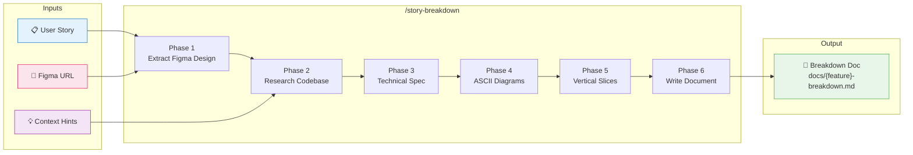
```mermaid
flowchart LR
    subgraph Inputs
        US["📋 User Story"]
        FIG["🎨 Figma URL"]
        CTX["💡 Context Hints"]
    end

    subgraph "/story-breakdown"
        direction TB
        P1["Phase 1<br/>Extract Figma Design"] --> P2["Phase 2<br/>Research Codebase"]
        P2 --> P3["Phase 3<br/>Technical Spec"]
        P3 --> P4["Phase 4<br/>ASCII Diagrams"]
        P4 --> P5["Phase 5<br/>Vertical Slices"]
        P5 --> P6["Phase 6<br/>Write Document"]
    end

    subgraph Output
        DOC["📄 Breakdown Doc<br/>docs/{feature}-breakdown.md"]
    end

    US --> P1
    FIG --> P1
    CTX --> P2
    P6 --> DOC

    style US fill:#E3F2FD,stroke:#1976D2
    style FIG fill:#FCE4EC,stroke:#E91E63
    style CTX fill:#F3E5F5,stroke:#9C27B0
    style DOC fill:#E8F5E9,stroke:#4CAF50
```

**What happens inside:**

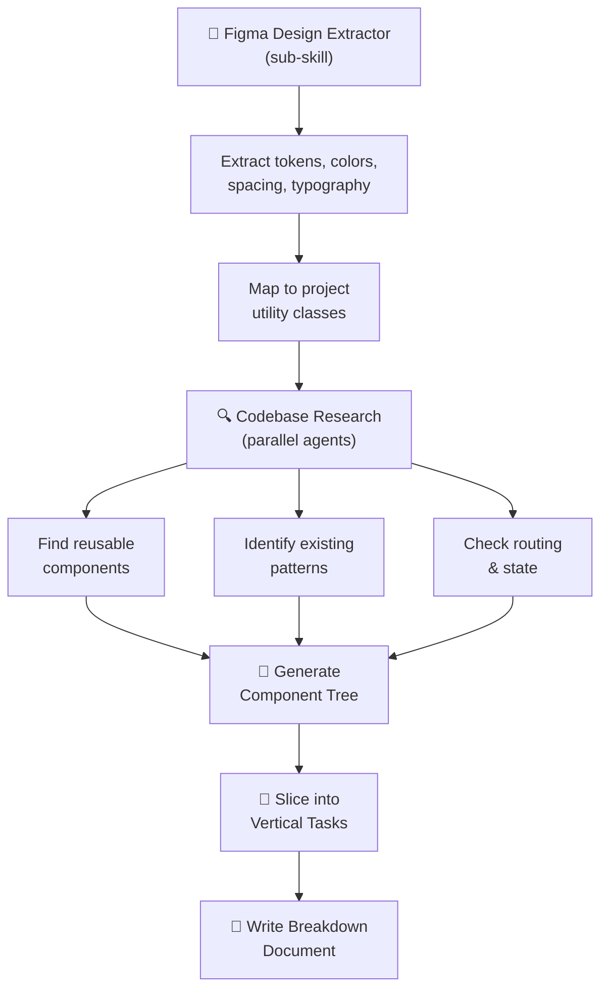
```mermaid
flowchart TD
    A["🎨 Figma Design Extractor<br/>(sub-skill)"] --> B["Extract tokens, colors,<br/>spacing, typography"]
    B --> C["Map to project<br/>utility classes"]
    C --> D["🔍 Codebase Research<br/>(parallel agents)"]
    D --> E["Find reusable<br/>components"]
    D --> F["Identify existing<br/>patterns"]
    D --> G["Check routing<br/>& state"]
    E & F & G --> H["📐 Generate<br/>Component Tree"]
    H --> I["🔪 Slice into<br/>Vertical Tasks"]
    I --> J["📄 Write Breakdown<br/>Document"]
```

---

## Skill 2: `/design-implementer`

> *"One architect, many builders — working in parallel."*

Reads the breakdown doc and orchestrates a team of AI agents, each working in isolated git worktrees to implement different slices simultaneously.

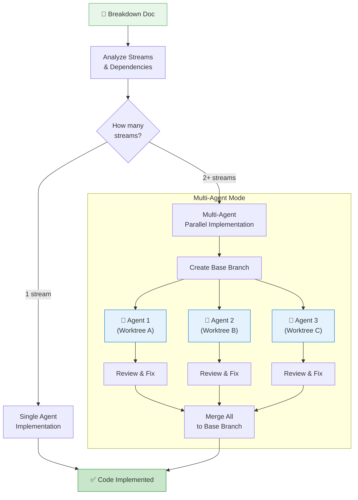
```mermaid
flowchart TD
    DOC["📄 Breakdown Doc"] --> ANALYZE["Analyze Streams<br/>& Dependencies"]

    ANALYZE --> DECIDE{How many<br/>streams?}

    DECIDE -->|"1 stream"| SINGLE["Single Agent<br/>Implementation"]
    DECIDE -->|"2+ streams"| MULTI["Multi-Agent<br/>Parallel Implementation"]

    subgraph "Multi-Agent Mode"
        MULTI --> BASE["Create Base Branch"]
        BASE --> W1["🔨 Agent 1<br/>(Worktree A)"]
        BASE --> W2["🔨 Agent 2<br/>(Worktree B)"]
        BASE --> W3["🔨 Agent 3<br/>(Worktree C)"]
        W1 --> R1["Review & Fix"]
        W2 --> R2["Review & Fix"]
        W3 --> R3["Review & Fix"]
        R1 --> MERGE["Merge All<br/>to Base Branch"]
        R2 --> MERGE
        R3 --> MERGE
    end

    SINGLE --> DONE["✅ Code Implemented"]
    MERGE --> DONE

    style DOC fill:#E8F5E9,stroke:#4CAF50
    style W1 fill:#E3F2FD,stroke:#1976D2
    style W2 fill:#E3F2FD,stroke:#1976D2
    style W3 fill:#E3F2FD,stroke:#1976D2
    style DONE fill:#C8E6C9,stroke:#388E3C
```

**The pipelining trick — agents don't wait idle:**

```mermaid
gantt
    title Parallel Implementation Timeline
    dateFormat X
    axisFormat %s

    section Agent 1
    Implement Stream A    :a1, 0, 3
    Self-review & fix     :a2, after a1, 1

    section Agent 2
    Implement Stream B    :b1, 0, 4
    Self-review & fix     :b2, after b1, 1

    section Agent 3
    Implement Stream C    :c1, 1, 4
    Self-review & fix     :c2, after c1, 1

    section Lead
    Orchestrate & monitor :l1, 0, 6
    Merge & verify        :l2, after l1, 1
```

---

## Skill 3: `/design-verify`

> *"Does the code match the design? Let's check pixel by pixel."*

Compares the implemented code against the original Figma design and breakdown document, using both static analysis and live browser inspection.

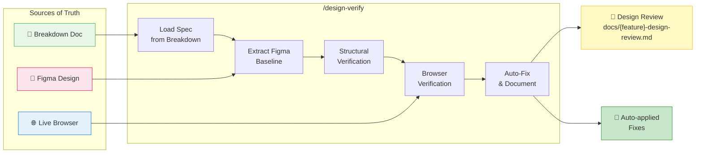
```mermaid
flowchart LR
    subgraph "Sources of Truth"
        BD["📄 Breakdown Doc"]
        FIG["🎨 Figma Design"]
        LIVE["🌐 Live Browser"]
    end

    subgraph "/design-verify"
        direction TB
        V1["Load Spec<br/>from Breakdown"] --> V2["Extract Figma<br/>Baseline"]
        V2 --> V3["Structural<br/>Verification"]
        V3 --> V4["Browser<br/>Verification"]
        V4 --> V5["Auto-Fix<br/>& Document"]
    end

    BD --> V1
    FIG --> V2
    LIVE --> V4

    V5 --> OUT["📄 Design Review<br/>docs/{feature}-design-review.md"]
    V5 --> FIX["🔧 Auto-applied<br/>Fixes"]

    style BD fill:#E8F5E9,stroke:#4CAF50
    style FIG fill:#FCE4EC,stroke:#E91E63
    style LIVE fill:#E3F2FD,stroke:#1976D2
    style OUT fill:#FFF9C4,stroke:#FBC02D
    style FIX fill:#C8E6C9,stroke:#388E3C
```

**What gets checked:**

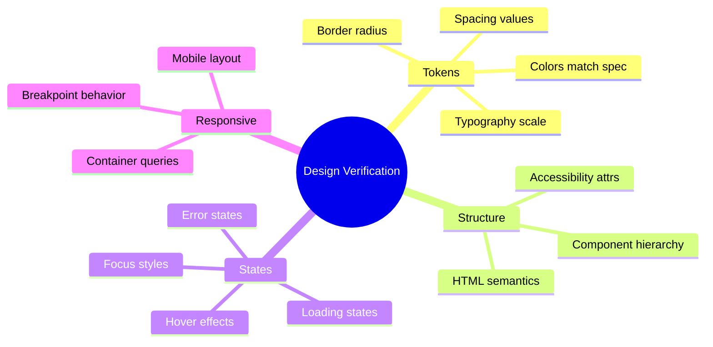
```mermaid
mindmap
  root(("Design Verification"))
    Tokens
      Colors match spec
      Spacing values
      Typography scale
      Border radius
    Structure
      Component hierarchy
      HTML semantics
      Accessibility attrs
    States
      Hover effects
      Focus styles
      Error states
      Loading states
    Responsive
      Breakpoint behavior
      Mobile layout
      Container queries
```

---

## Skill 4: `/pr-creator`

> *"Package it up and ship it out."*

Creates (or updates) the GitHub PR with a clean description, then waits for CI to pass. The PR has
to exist before the reviewer can run, because `/pr-reviewer --fix` reviews a PR by number and posts
its summary back onto that PR.

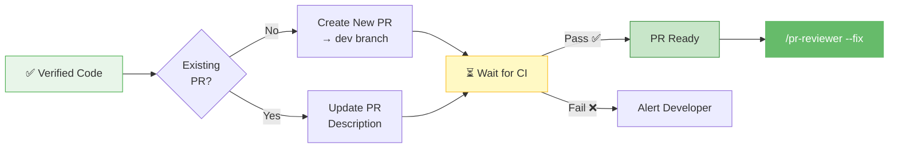
```mermaid
flowchart LR
    CHANGES["✅ Verified Code"] --> CHECK{"Existing<br/>PR?"}

    CHECK -->|No| CREATE["Create New PR<br/>→ dev branch"]
    CHECK -->|Yes| UPDATE["Update PR<br/>Description"]

    CREATE --> CI["⏳ Wait for CI"]
    UPDATE --> CI

    CI -->|Pass ✅| READY["PR Ready"]
    CI -->|Fail ❌| NOTIFY["Alert Developer"]

    READY --> NEXT["/pr-reviewer --fix"]

    style CHANGES fill:#E8F5E9,stroke:#4CAF50
    style CI fill:#FFF9C4,stroke:#FBC02D
    style READY fill:#C8E6C9,stroke:#388E3C
    style NEXT fill:#66BB6A,stroke:#66BB6A,color:#fff
```

---

## Skill 5: `/pr-reviewer <pr> --fix`

> *"Review the code. Argue with the review. Fix what survives."*

Runs a multi-agent code review over the PR's diff, then triages the findings and applies the ones
that hold up.

**This replaces `/pr-review-and-fix`.** That skill was merged into `pr-reviewer` behind the `--fix`
flag in `yond-dev` 0.8.0 and no longer exists — the old slash command resolves to nothing.

Three things differ from the skill it replaces:

- **The fixer is not the reviewer.** FixAgent never sees a lens's reasoning. It sees the finding,
  the code and the repo's conventions — what a human triaging the review sees — and it is expected
  to disagree with some of them. The old design fixed everything it was told to, which turned a
  reviewer's false positive into a commit.
- **It fixes, it does not refactor.** A finding that cannot be addressed without touching lines it
  does not name, moving code between files or changing a signature is a `disagree`. Suggestions are
  never acted on; they are the author's call.
- **It has hard stops, not warnings.** It refuses a dirty working tree, a `HEAD` that moved since
  the review, a failed review, and the `--ci` flag. Commit and push before you run it.

The review reads the target repo's own conventions at runtime, so it carries no repo-specific
knowledge. A repo can pin its rules in `.claude/pr-review/conventions.md` — add that file to
`.prettierignore`, or prettier rewrites `## scope: **` as `## scope: \*\*` and every scoped rule
matches nothing.

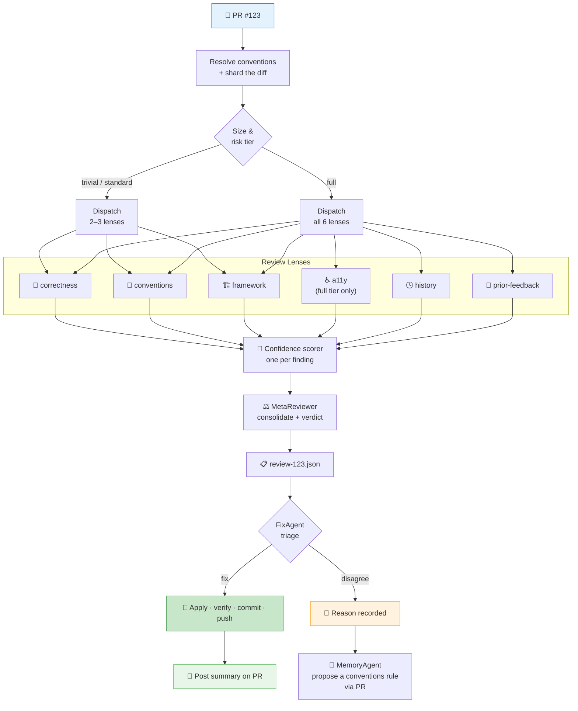
```mermaid
flowchart TD
    PR["🔀 PR #123"] --> SETUP["Resolve conventions<br/>+ shard the diff"]

    SETUP --> TIER{"Size &<br/>risk tier"}

    TIER -->|trivial / standard| FEW["Dispatch<br/>2–3 lenses"]
    TIER -->|full| ALL["Dispatch<br/>all 6 lenses"]

    subgraph "Review Lenses"
        L1["🐛 correctness"]
        L2["📐 conventions"]
        L3["🏗️ framework"]
        L4["♿ a11y<br/>(full tier only)"]
        L5["🕓 history"]
        L6["💬 prior-feedback"]
    end

    FEW --> L1 & L2 & L3
    ALL --> L1 & L2 & L3 & L4 & L5 & L6

    L1 & L2 & L3 & L4 & L5 & L6 --> SCORE["🎯 Confidence scorer<br/>one per finding"]
    SCORE --> META["⚖️ MetaReviewer<br/>consolidate + verdict"]
    META --> REVIEW["📋 review-123.json"]

    REVIEW --> TRIAGE{"FixAgent<br/>triage"}
    TRIAGE -->|fix| APPLY["🔧 Apply · verify · commit · push"]
    TRIAGE -->|disagree| WHY["📝 Reason recorded"]

    APPLY --> COMMENT["💬 Post summary on PR"]
    WHY --> MEM["🧠 MemoryAgent<br/>propose a conventions rule<br/>via PR"]

    style PR fill:#E3F2FD,stroke:#1976D2
    style APPLY fill:#C8E6C9,stroke:#388E3C
    style COMMENT fill:#E8F5E9,stroke:#4CAF50
    style WHY fill:#FFF3E0,stroke:#FF9800
```

---

## Skill 6: `/pr-slack-announcer`

> *"Hey team, this is ready for your eyes."*

Generates a Slack message with the PR link, preview URL, deep links to changed routes/stories, and testing notes.

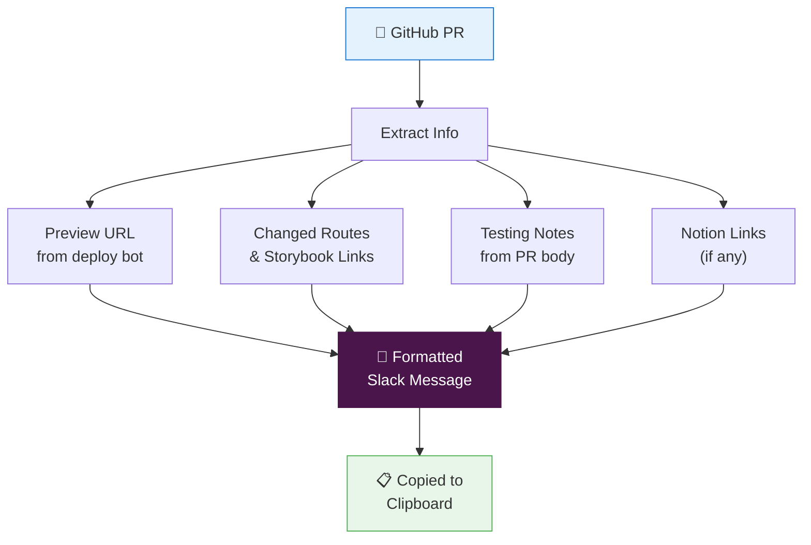
```mermaid
flowchart TD
    PR["🔗 GitHub PR"] --> EXTRACT["Extract Info"]

    EXTRACT --> URL["Preview URL<br/>from deploy bot"]
    EXTRACT --> ROUTES["Changed Routes<br/>& Storybook Links"]
    EXTRACT --> NOTES["Testing Notes<br/>from PR body"]
    EXTRACT --> NOTION["Notion Links<br/>(if any)"]

    URL & ROUTES & NOTES & NOTION --> MSG["📢 Formatted<br/>Slack Message"]

    MSG --> CLIP["📋 Copied to<br/>Clipboard"]

    style PR fill:#E3F2FD,stroke:#1976D2
    style MSG fill:#4A154B,stroke:#4A154B,color:#fff
    style CLIP fill:#E8F5E9,stroke:#4CAF50
```

---

## The Complete Data Flow

How artifacts flow between skills from start to finish:

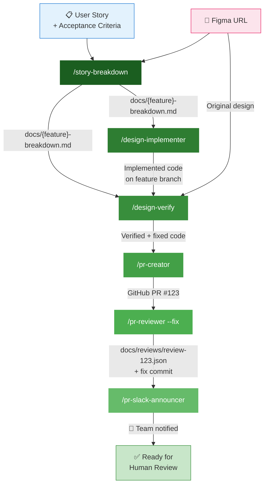
```mermaid
flowchart TD
    US["📋 User Story<br/>+ Acceptance Criteria"] --> SB
    FIG["🎨 Figma URL"] --> SB

    SB["/story-breakdown"]
    SB -->|"docs/{feature}-breakdown.md"| DI
    SB -->|"docs/{feature}-breakdown.md"| DV

    DI["/design-implementer"]
    DI -->|"Implemented code<br/>on feature branch"| DV

    FIG -->|"Original design"| DV

    DV["/design-verify"]
    DV -->|"Verified + fixed code"| PRC

    PRC["/pr-creator"]
    PRC -->|"GitHub PR #123"| PRR

    PRR["/pr-reviewer --fix"]
    PRR -->|"docs/reviews/review-123.json<br/>+ fix commit"| PSA

    PSA["/pr-slack-announcer"]
    PSA -->|"📢 Team notified"| DONE["✅ Ready for<br/>Human Review"]

    style US fill:#E3F2FD,stroke:#1976D2
    style FIG fill:#FCE4EC,stroke:#E91E63
    style SB fill:#1B5E20,stroke:#1B5E20,color:#fff
    style DI fill:#2E7D32,stroke:#2E7D32,color:#fff
    style DV fill:#388E3C,stroke:#388E3C,color:#fff
    style PRC fill:#43A047,stroke:#43A047,color:#fff
    style PRR fill:#4CAF50,stroke:#4CAF50,color:#fff
    style PSA fill:#66BB6A,stroke:#66BB6A,color:#fff
    style DONE fill:#C8E6C9,stroke:#388E3C
```

---

## Supporting Cast

These skills aren't in the main pipeline but support it at various points:

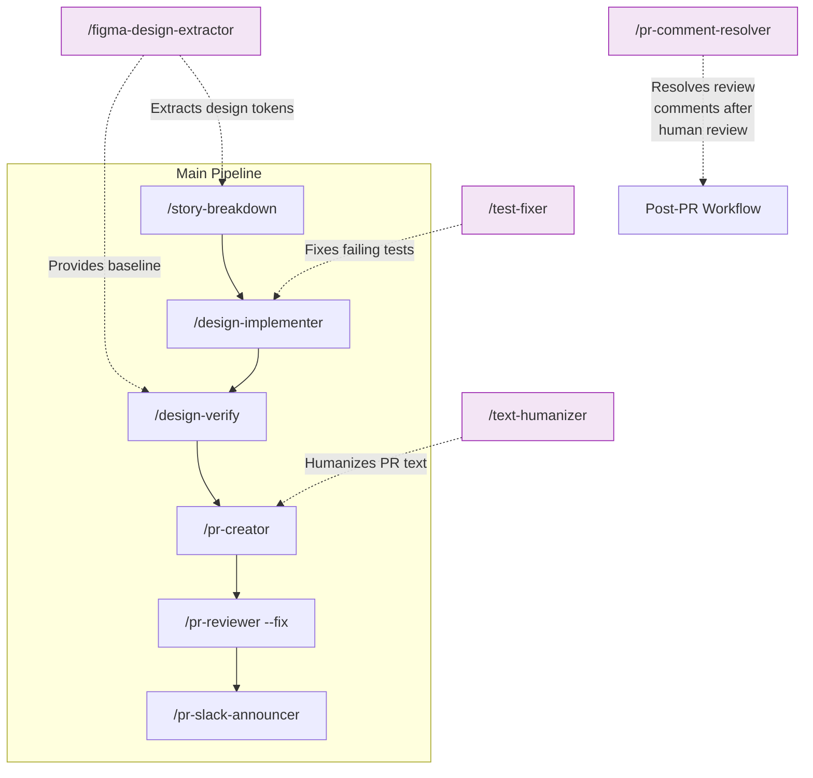
```mermaid
flowchart TD
    subgraph "Main Pipeline"
        SB["/story-breakdown"] --> DI["/design-implementer"]
        DI --> DV["/design-verify"]
        DV --> PRC["/pr-creator"]
        PRC --> PRR["/pr-reviewer --fix"]
        PRR --> PSA["/pr-slack-announcer"]
    end

    FDE["/figma-design-extractor"] -.->|"Extracts design tokens"| SB
    FDE -.->|"Provides baseline"| DV

    TF["/test-fixer"] -.->|"Fixes failing tests"| DI
    TH["/text-humanizer"] -.->|"Humanizes PR text"| PRC

    PCR["/pr-comment-resolver"] -.->|"Resolves review<br/>comments after<br/>human review"| DONE["Post-PR Workflow"]

    style FDE fill:#F3E5F5,stroke:#9C27B0
    style TF fill:#F3E5F5,stroke:#9C27B0
    style TH fill:#F3E5F5,stroke:#9C27B0
    style PCR fill:#F3E5F5,stroke:#9C27B0
```

---

## After the PR: The Review Loop

Once the team reviews the PR, there's one more skill that closes the loop:

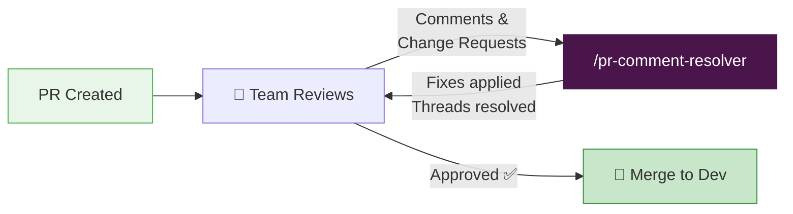
```mermaid
flowchart LR
    PR["PR Created"] --> TEAM["👥 Team Reviews"]
    TEAM -->|"Comments &<br/>Change Requests"| PCR["/pr-comment-resolver"]
    PCR -->|"Fixes applied<br/>Threads resolved"| TEAM
    TEAM -->|"Approved ✅"| MERGE["🚀 Merge to Dev"]

    style PR fill:#E8F5E9,stroke:#4CAF50
    style PCR fill:#4A154B,stroke:#4A154B,color:#fff
    style MERGE fill:#C8E6C9,stroke:#388E3C
```

---

## Human vs AI Responsibilities

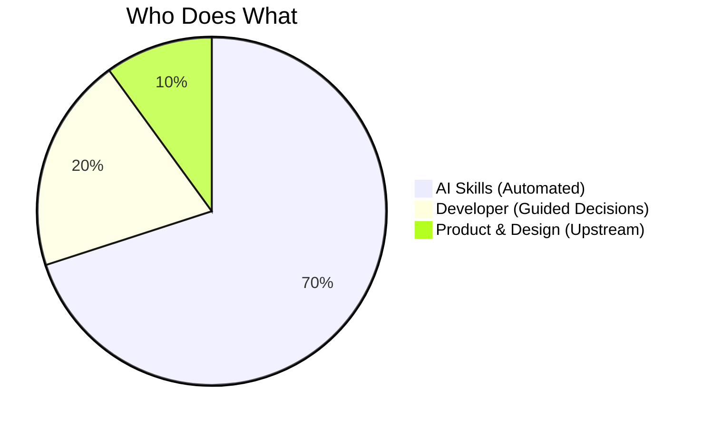
```mermaid
pie title Who Does What
    "AI Skills (Automated)" : 70
    "Developer (Guided Decisions)" : 20
    "Product & Design (Upstream)" : 10
```

| Phase | Who | What |
|-------|-----|------|
| Research & User Stories | Product | Interviews, prioritization, story writing |
| Figma Design | Design | Visual design, prototyping, iteration |
| **Story Breakdown** | **AI + Developer** | AI analyzes, developer reviews & approves |
| **Implementation** | **AI Agents** | Parallel implementation in worktrees |
| **Design Verification** | **AI** | Automated pixel-level comparison |
| **PR Creation** | **AI** | Auto-generated PR with CI monitoring |
| **Code Review & Fix** | **AI** | Multi-agent review, then triage — the fixer may disagree with a finding |
| **Slack Announcement** | **AI** | Formatted message with deep links |
| Human Code Review | Team | Final sign-off on quality and approach |
| **Comment Resolution** | **AI + Developer** | AI fixes, developer approves approach |
| Merge & Deploy | Developer | Final merge button press |

---

## The Automation Frontier

Areas outside the current developer workflow where AI could help next:

```mermaid
flowchart TD
    subgraph "🟢 Automated Today"
        A1["Story Breakdown"]
        A2["Code Implementation"]
        A3["Design Verification"]
        A4["Code Review"]
        A5["PR Creation"]
        A6["Team Notification"]
        A7["Comment Resolution"]
    end

    subgraph "🟡 Partially Automated"
        B1["Prototyping<br/>(/yond-prototyper)"]
        B2["Bug Investigation<br/>(/issue-executor)"]
        B3["Test Writing<br/>(/test-fixer)"]
    end

    subgraph "🔴 Manual Today — Future Opportunities"
        C1["User Research<br/>Synthesis"]
        C2["Acceptance Criteria<br/>Generation"]
        C3["Figma Design<br/>from Requirements"]
        C4["Design QA by<br/>Design Team"]
        C5["Release Notes<br/>& Changelog"]
        C6["Stakeholder<br/>Demo Prep"]
    end

    C1 -.->|"Could AI summarize<br/>research findings?"| B1
    C2 -.->|"Could AI draft<br/>criteria from research?"| A1
    C3 -.->|"Could AI generate<br/>initial layouts?"| B1
    C5 -.->|"Could AI compile<br/>from merged PRs?"| A5

    style A1 fill:#C8E6C9,stroke:#388E3C
    style A2 fill:#C8E6C9,stroke:#388E3C
    style A3 fill:#C8E6C9,stroke:#388E3C
    style A4 fill:#C8E6C9,stroke:#388E3C
    style A5 fill:#C8E6C9,stroke:#388E3C
    style A6 fill:#C8E6C9,stroke:#388E3C
    style A7 fill:#C8E6C9,stroke:#388E3C
    style B1 fill:#FFF9C4,stroke:#FBC02D
    style B2 fill:#FFF9C4,stroke:#FBC02D
    style B3 fill:#FFF9C4,stroke:#FBC02D
    style C1 fill:#FFCDD2,stroke:#E53935
    style C2 fill:#FFCDD2,stroke:#E53935
    style C3 fill:#FFCDD2,stroke:#E53935
    style C4 fill:#FFCDD2,stroke:#E53935
    style C5 fill:#FFCDD2,stroke:#E53935
    style C6 fill:#FFCDD2,stroke:#E53935
```

---

## Quick Reference: Skill Cheat Sheet

| Skill | Command | Input | Output |
|-------|---------|-------|--------|
| Story Breakdown | `/story-breakdown` | Story + Figma URL | `docs/{feature}-breakdown.md` |
| Design Implementer | `/design-implementer` | Breakdown doc path | Implemented code on branch |
| Design Verify | `/design-verify` | Breakdown doc path | `docs/{feature}-design-review.md` |
| PR Creator | `/pr-creator` | Current branch | GitHub PR |
| PR Review & Fix | `/pr-reviewer <pr> --fix` | PR number (clean tree required) | `docs/reviews/review-<pr>.json` + fix commit + PR comment |
| Slack Announcer | `/pr-slack-announcer` | PR number (auto-detect) | Slack message on clipboard |
| Comment Resolver | `/pr-comment-resolver` | PR with comments | Resolved threads + fixes |
